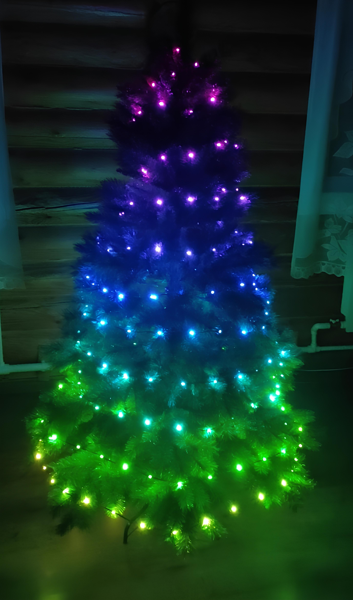
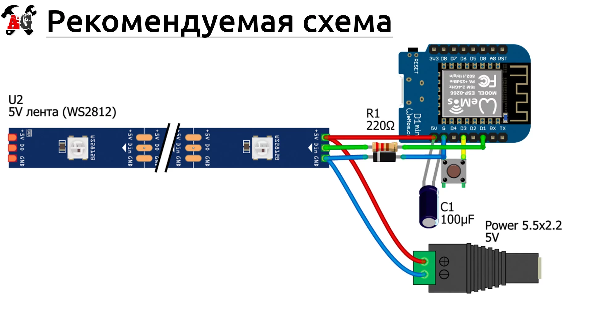

# (Без)Умная гирлянда



Контроллер для адресной светодиодной ленты в виде гирлянды на ёлку на базе микроконтроллера WeMos D1 Mini (esp8266). Воспринимает гирлянду как коническую спираль, что позволяет воспроизводить на ней 3д эффекты.

## Особенности

- **Разнообразие эффектов**: в программе реализовано 36 эффектов разных типов;
- **Продвинутая рисовалка**: возможность рисовать и создавать анимации (гифки) на гирлянде. На фон анимации можно накладывать другие эффекты;
- **Удаленное управление**: гирлянда управляется с любого устройства по Wi-Fi через удобное приложение в [appex-system](https://github.com/andaran/appex-system);
- **Множество возможностей**: настройка яркости, таймера выключения, слайдшоу из эффектов.
- **Технологичность**: в основе проекта лежит динамический цифровой двойник ёлки, позволяющий удобно управлять гирляндой и разрабатывать эффекты.

## Сборка

Проект основывается на базовой схеме подключения светодиодной ленты к микроконтроллеру WeMos D1 Mini:



## Установка

1. Установить расширение platformio для VSCode или другого редактора;

2. Склонировать репозиторий:

```bash
git clone https://github.com/andaran/smart_garland
```

3. Создать файл `src/settings.h` и настроить параметры гирлянды:

```cpp
#pragma once

// Сетевые настройки
#define ussid "ussid" // Название Wi-Fi сети
#define pass "pass"  // Пароль Wi-Fi сети

#define roomIDSetting "roomID" // ID комнаты в appex
#define roomPassSetting "roomPass" // Пароль комнаты

// Параметры ленты
#define LED_PIN D1 // Пин ленты
#define NUM_LEDS 200 // Количество светодиодов
#define BASE64_LENGTH 901 // 3 * NUM_LEDS * 3 / 2 + 1

// Кнопка
#define BUTTON_PIN D3 // Пин кнопки
```

4. Скомпилировать прошивку и загрузить на микроконтроллер;

## Первое включение

1. Намотать гирлянду на ёлку по рекомендациям приложения.

2. Подключить гирлянду к контроллеру, контроллер к питанию. На гирлянде загорятся белые огоньки.

3. Открыть терминал в приложении. Включить режим стрима состояния гирлянды через wifi и войти в режим настройки 3д модели ёлки:

```
stream wifi
```
```
setup model
```

4. Настроить параметры расположения витков гирлянды на ёлке c помощью команды, рекомендуемой приложением. Пример:

```
turns 33 31 27 24 22 18 15 12 8 6 4
```

5. На гирлянде отобразится синяя полоска вдоль образующей конуса ёлки. При необходимости её можно подкорректировать. Затем завершить настройку:

```
setup done
```

6. Приятного использования!

## Эффекты

Проект поддерживает множество эффектов разных типов. Эффекты каждого типа представлены в разных цветовых исполнениях.

### 1. **Простые эффекты**
- **rainbow**: Цвета плавно меняются по очереди (цветовое колесо).

### 2. **Мерцающие цвета**
Позволяют настроить гирлянду на один цвет, каждый светодиод плавно меняет яркость от минимума к максимуму и обратно:
- **cherry**
- **lime**
- **blueberry**
- **gold**
- **deep**
- **peony**
- **dream**
- **lemongrass**

### 3. **Эффекты на основе палитр**
Используют заранее заданные палитры цветовых градиентов для создания плавных переходов с помощью линейной интерполяции:
- **cyberpunk**
- **sunset**
- **optimus**
- **warm**
- **cold**
- **hot**
- **pink**
- **comfy**
- **girl**
- **christmas**
- **acid**
- **smoke**
- **aurora**
- **redwhite**
- **ocean**
- **fog**

Часть эффектов взята из [проекта Алекса Гайвера](https://github.com/AlexGyver/GyverTwink)

### 4. **Эффекты - полоски**
Полоски из двух цветов, вращающиеся вокруг ёлки (3д эффект):
- **candy**
- **police**
- **blueberry-candy**
- **lemonade**
- **mint-candy**
- **strawberry**

### 5. **Эффекты - дождь**
Имитируют дождь с различными цветами капель (3д эффект):
- **rain**
- **snow**
- **acid-rain**
- **bite-a-lemon**
- **hell-rain**

## Документация по командам

### Универсальные команды

```
setup <args>
```
Команда для перехода в режим настройки. При аргументе `"done"` завершает настройку и возвращает в начальное состояние. Для начала настройки анимации или модели:
- `"anim <name>"` — начало настройки анимации с указанным именем;
- `"model"` — начало настройки модели.

```
save
```
Сохраняет текущие изменения. Работает только в контексте настройки анимации.

```
remove <args>
```
Удаляет анимацию по указанному имени. Используется формат:
- `remove anim <name>`

```
memory
```
Выводит информацию о текущем состоянии памяти устройства, включая общий объём, свободную память и степень фрагментации.

```
fs <args>
```
Управляет файловой системой. Доступны следующие аргументы:
- `"format"` — форматирует файловую систему;
- `"list"` — выводит список файлов в корневой директории;
- `"status"` — выводит информацию о статусе файловой системы (в Кб);
- `"remove <filename>"` — удаляет файл;
- `"read <filename>"` — читает содержимое файла.

```
stream <args>
```
Управляет состоянием трансляции состояния гирлянды. При отсутствии аргумента возвращает текущее состояние:
- `"off"` — стрим выключен;
- `"wifi"` — стрим через Wi-Fi;
- `"cable"` — стрим через кабель.

---

### Команды основного состояния

```
effect <args>
```
Устанавливает эффект для ленты. При отсутствии аргументов возвращает текущий эффект. В качестве аргумента можно передать:
- `"random"` — случайный эффект;
- `"<effect-name>"` — для выбора нужного эффекта;
- `"anim-<name>"` — для выбора пользовательской анимации.

```
power <args>
```
Включает или выключает ленту. При отсутствии аргумента возвращает текущее состояние ленты. В качестве аргумента можно передать:
- `"on"` — включить ленту;
- `"off"` — выключить ленту.

```
brightness <args>
```
Устанавливает яркость ленты в диапазоне от 0 до 255. При отсутствии аргумента возвращает текущую яркость.
- `"<brightness:unsigned>"` — устанавливает яркость.

```
timer <args>
```
Устанавливает таймер для ленты. При отсутствии аргумента возвращает текущее состояние таймера. В качестве аргумента можно передать:
- `"off"` — выключить таймер;
- `"<duration:unsigned>"` — установить таймер на указанное количество минут.

```
slideshow <args>
```
Управляет слайдшоу. При отсутствии аргумента запускает слайдшоу с предыдущим тайм-аутом. В качестве аргумента можно передать:
- `"off"` — остановить слайдшоу;
- `"<timeout:unsigned>"` — установить тайм-аут для слайдшоу.

---

### Команды настройки анимации

```
led <args>
```
Добавляет или удаляет светодиоды для анимации. Поддерживает следующие подкоманды:
- `"add <index> <r> <g> <b>"` — добавляет светодиод на указанную позицию с заданными цветами (RGB);
- `"remove <index>"` — удаляет светодиод с указанного индекса.

```
background <args>
```
Добавляет или удаляет фоновый эффект для анимации. Поддерживает следующие подкоманды:
- `<name>` — добавляет фоновый эффект с указанным именем;
- `"remove"` — удаляет фоновый эффект.

```
frame <args>
```
Управляет кадрами анимации. При отсутствии аргумента возвращает текущий кадр. Поддерживает следующие подкоманды:
- `"next"` — переключается на следующий кадр;
- `"prev"` — переключается на предыдущий кадр;
- `"delete"` — удаляет текущий кадр.

```
duration <args>
```
Устанавливает длительность кадра анимации. В качестве аргумента передаётся длительность в миллисекундах. При отсутствии аргумента возвращает текущую длительность.
- `"<duration:unsigned>"` — устанавливает длительность.

---

### Команды настройки модели ёлки

```
turns <args>
```
Обновляет количество светодиодов в каждом витке гирлянды. Аргументом передаётся строка с числами, разделёнными пробелами, которые определяют количество светодиодов в каждом витке. Пример:

`"turns 33 31 27 24 22 18 15 12 8 6 4"`

После выполнения команды обновляется модель ёлки.